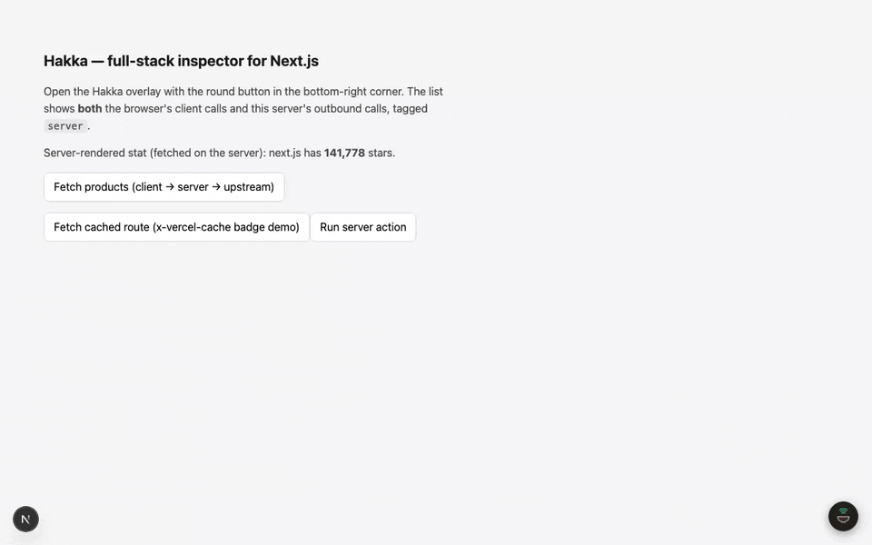
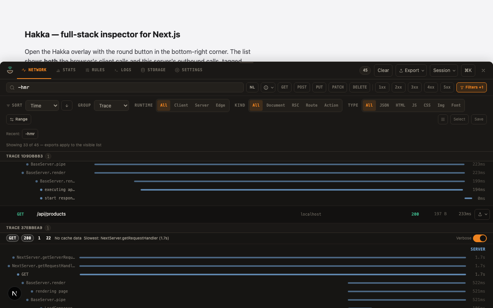

# Hakka

[](https://www.npmjs.com/package/hakka-react-native) [](https://www.npmjs.com/package/hakka-browser) [](./LICENSE) [](https://hakka.noodleapps.com)

Local-first network inspector for React Native, the web, Next.js, Android, and iOS. Captures traffic in-process (no proxy, no CA certificate, no cloud, no accounts), stores it in bounded buffers, and exposes it through in-app overlays, HAR/OpenTelemetry/Postman/cURL export, and an MCP server your AI agent can query.



**New: full-stack Next.js tracing.** Two files (`instrumentation.ts`, `instrumentation-client.ts`) and `npm i hakka-node` turn a client fetch, the server route it hits, and the upstream call that route makes into one trace waterfall, built on Next's own OpenTelemetry spans. Mock, breakpoint, and throttle rules reach server-side fetches too, not only what the browser sends.



Production cost is measured, not assumed. `register()` dead-code-eliminates out of prod builds; a 600-request benchmark against `next start` put p50 latency at 1.91ms with Hakka installed versus 1.81ms fully disabled, a gap smaller than the noise between two runs of the same config (see [`examples/next-fullstack`](./examples/next-fullstack/README.md)). An opt-in cohort mode captures a header-gated slice of real production traffic for when local repro isn't enough.

For agents: an MCP server with twenty-one tools (search, diagnose, detect a leaked credential or PII, mock, promote a capture straight to a mock, breakpoint, throttle, a `.hakka-repro` bundle with a generated regression test), plus a **Copy as agent context** button on every request that pastes a size-budgeted evidence bundle straight into a chat.

One engine ([`hakka-core`](./packages/hakka-core)) powers every target, so the capture model, record contract, panels, and exports stay identical across React Native, iOS, Android, and the web, including inside WebViews. The web entry point costs 2,996 bytes gzipped until someone opens the panel, 124 KB gzipped once they do.

## Packages

7 npm packages, all `0.1.0`, plus native SDKs for Android and iOS.

### Engine

| Package                               | What it is                                                                                                                                                                                                                                        |
| ------------------------------------- | ------------------------------------------------------------------------------------------------------------------------------------------------------------------------------------------------------------------------------------------------- |
| [`hakka-core`](./packages/hakka-core) | The platform-neutral capture engine — interceptors, ring buffer, mock/throttle engines, HAR + OpenTelemetry export, record contract. One dep (`fflate`). Also ships `hakka-core/test` — framework-agnostic helpers to assert on captured traffic. |

### Framework SDKs

| Package                                               | What it is                                                                                                                                                                                                                                                                                                                                                           | Status                                                |
| ----------------------------------------------------- | -------------------------------------------------------------------------------------------------------------------------------------------------------------------------------------------------------------------------------------------------------------------------------------------------------------------------------------------------------------------- | ----------------------------------------------------- |
| [`hakka-react-native`](./packages/hakka-react-native) | React Native SDK: native iOS/Android capture + JS fallback + optional in-app inspector.                                                                                                                                                                                                                                                                              |      |
| [`hakka-browser`](./packages/hakka-browser)           | Drop-in browser overlay (Solid, Shadow DOM, Web Worker store). Also ships `hakka-browser/vite`, `/webpack`, `/rspack` (dev-time auto-inject plugins), `/elements/*` (six standalone inspector pieces as framework-agnostic custom elements — request list, detail, waterfall, filter bar, stats, JSON tree), and `/react` (thin React wrappers over those elements). |  |
| [`hakka-node`](./packages/hakka-node)                 | Framework-agnostic Node server capture (Express, Fastify, Hono, raw `http`) with client↔server trace correlation. Also ships `hakka-node/next` (+ `/next/server`, `/next/client`) — zero-config full-stack Next.js capture, server + client traffic in one UI.                                                                                                       |  |

Beta: `hakka-react-native` works fully and ships on npm. It has less production soak time than the web and Next.js SDKs.

### Native SDKs

| SDK                                                            | What it is                                                                                                | Status                                              |
| -------------------------------------------------------------- | --------------------------------------------------------------------------------------------------------- | --------------------------------------------------- |
| [`android/`](./android) (Kotlin, Maven `com.noodleapps.hakka`) | OkHttp interceptor, optional native inspector surface, FPS/memory/CPU collectors, noop release artifacts. |  |
| [`ios/`](./ios) (Swift Package)                                | URLProtocol capture, optional SwiftUI inspector, performance collectors, noop release targets.            |  |

Alpha: both native SDKs work from source in this repo today. `android/` isn't on Maven Central yet and `ios/` doesn't have a published SPM semver tag yet.

### Tooling & Embedding

| Package                                       | What it is                                                                                                                                                                                                                                                |
| --------------------------------------------- | --------------------------------------------------------------------------------------------------------------------------------------------------------------------------------------------------------------------------------------------------------- |
| [`hakka-bridge`](./packages/hakka-bridge)     | WebSocket hub that relays captured requests between the web/Next/Node/RN/MCP peers.                                                                                                                                                                       |
| [`hakka-rozenite`](./packages/hakka-rozenite) | **EXPERIMENTAL.** Hakka as a React Native DevTools panel via Rozenite, built on `hakka-browser`'s `/elements` and `/react` subpaths.                                                                                                                      |
| [`hakka-cli`](./packages/hakka-cli)                   | `npx hakka-cli init` — framework-aware setup. Also `hakka diagnose` and `hakka assert` for saved captures, and `hakka mcp` (+ `hakka-cli/mcp` subpath) / `hakka cdp` (+ `hakka-cli/cdp` subpath) — the MCP server for AI agents and Chrome DevTools Protocol capture. |

## Highlights

- **Dead-simple setup** — `npx hakka-cli init` detects your framework and wires it, or one line does it: `OkHttpClient.Builder().installHakka(context)` on Android, `Hakka.start()` on RN, one `<script>` on the web.
- **Native capture on both mobile platforms** — OkHttp interceptor (Android), URLProtocol (iOS); JS fetch/XHR/WebSocket fallback where native can't see traffic.
- **Change traffic, don't just watch it** — pause-and-edit breakpoints, mocking, block, Map Remote redirect, rewrite, and network-condition throttling, all in-process with no proxy or cert. See [Breakpoints](https://hakka.noodleapps.com/features/breakpoints) and [Mocking](https://hakka.noodleapps.com/features/mocking).
- **Agent-native** — one command wires it up: `claude mcp add hakka -- npx -y hakka-cli mcp`. The MCP server gives Claude Code and other AI agents read tools, a one-call `diagnose` ("why did checkout 500?"), and write tools (mock, breakpoint, throttle). An agent can find the failure, fix it, then package a repro. See [MCP server](https://hakka.noodleapps.com/mcp/overview).
- **Structured logging and performance** — write app logs that land in the inspector's Logs tab (Timber, os_log, or console), plus FPS, slow and frozen frames, memory, and CPU.
- **Exports, including OpenTelemetry** — HAR, Postman, shell-safe cURL, and OTel JSON (requests as spans, performance as metrics, health as logs) on every platform. The JS packages (`hakka-core`, `hakka-browser`, `hakka-react-native`) add a **live OTLP/HTTP push** to any collector — Grafana, Honeycomb, an OTel Collector.
- **Reproduce bundle** — one `.hakka-repro` file with a failing request, the mocks that replay it, and a generated test.
- **Release-safe no-op artifacts** — zero overhead in production builds.

## Install

Full guide: [hakka.noodleapps.com/getting-started/install](https://hakka.noodleapps.com/getting-started/install). Or run `npx hakka-cli init` to detect your framework and wire it up.

Working with an AI coding agent? Paste [the setup prompt](https://hakka.noodleapps.com/getting-started/overview) into it and it does the framework detection and file writes itself, same result as `npx hakka-cli init` with no manual steps. Once this repo is public, the same flow installs as a reusable skill: `npx skills add ansumanshah/hakka@hakka-setup`.

### React Native

```bash
npm install hakka-react-native @react-native-clipboard/clipboard
cd ios && pod install
```

```tsx
import { Hakka } from 'hakka-react-native'

Hakka.start({ mode: 'auto' })
```

Optional inspector UI (requires Reanimated 4 peers):

```tsx
import { HakkaInspector } from 'hakka-react-native/ui'

export function App() {
  return (
    <HakkaInspector.Wrapper mode="bubble">
      <YourApp />
    </HakkaInspector.Wrapper>
  )
}
```

Add the Worklets plugin last in your Babel config:

```js
module.exports = {
  presets: ['module:@react-native/babel-preset'],
  plugins: ['react-native-worklets/plugin'],
}
```

### Expo (development build only — Expo Go is not supported)

```bash
npx expo install hakka-react-native @react-native-clipboard/clipboard expo-dev-client
```

```json
{ "expo": { "plugins": ["hakka-react-native"] } }
```

```bash
npx expo prebuild --clean
```

### Web

```bash
npm install hakka-browser
```

```ts
if (import.meta.env.DEV) {
  const { start } = await import('hakka-browser')
  start()
}
```

Or via Vite with zero app code:

```ts
// vite.config.ts
import hakka from 'hakka-browser/vite'

export default { plugins: [hakka()] }
```

### Next.js (full-stack)

```bash
npm install hakka-node hakka-browser
```

```ts
// instrumentation.ts
export { register } from 'hakka-node/next'
```

```ts
// instrumentation-client.ts
import 'hakka-node/next/client'
```

Server and client requests show up in one overlay. Requires Next 15.3+.

### Android

```kotlin
dependencies {
    debugImplementation("com.noodleapps.hakka:hakka-network:0.1.0")
    debugImplementation("com.noodleapps.hakka:hakka-ui:0.1.0")
    releaseImplementation("com.noodleapps.hakka:hakka-network-noop:0.1.0")

    // optional performance collectors
    debugImplementation("com.noodleapps.hakka:hakka-performance:0.1.0")
    releaseImplementation("com.noodleapps.hakka:hakka-performance-noop:0.1.0")
}
```

One line wires capture plus the inspector (auto-launcher notification, shake-to-open) and native performance monitoring:

```kotlin
import com.noodleapps.hakka.ui.installHakka

val client = OkHttpClient.Builder()
    .installHakka(context, perfMonitoring = true)
    .build()
```

Headless (capture only, no UI): `.addInterceptor(HakkaInterceptor())`.

### iOS (Swift Package Manager)

Add the `ios/` package and select the products you need: `HakkaNetwork`, `HakkaNetworkNoop`, `HakkaPerformance`, `HakkaPerformanceNoop`, `HakkaUI`.

```swift
import HakkaNetwork

HakkaInterceptor().start()
```

## Docs

[hakka.noodleapps.com](https://hakka.noodleapps.com)

- [Overview](https://hakka.noodleapps.com/getting-started/overview)
- [hakka-core engine](https://hakka.noodleapps.com/core/overview)
- [Architecture](https://hakka.noodleapps.com/contributing/architecture)
- [Contributing](./CONTRIBUTING.md)

## License

MIT. See [LICENSE](./LICENSE).
