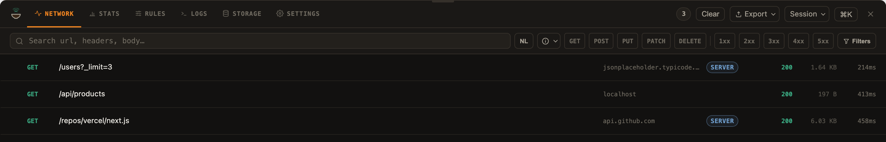

import { Tabs, TabItem, Steps, Aside, Card, CardGrid, LinkCard, Badge } from '@astrojs/starlight/components'

<Aside type="tip" title="What you'll have">
  By the end of this page, your Next.js app captures server and client network requests and shows them together in the
  Hakka overlay, tagged by runtime. No proxy, no CA cert, no cloud account.
</Aside>

`hakka-node`'s `/next` subpath instruments the Next.js server runtime — Server Components, Route Handlers, and Server Actions — and streams captures to the same bridge hub the browser overlay connects to. Server and client requests appear in one UI, tagged by runtime.

<Badge text="Stable" variant="success" />

## Try it in two minutes

The repo ships a working example with eleven traffic generators and a checklist, so you can see server and client capture side by side before wiring anything into your own app.

<Steps>

1. Clone the repo and run the example:

   ```bash title="Terminal"
   git clone https://github.com/ansumanshah/hakka.git
   cd hakka/examples/next-fullstack
   npm install
   npm run dev
   ```

   <Aside type="caution" title="Use npm here, not bun">
     `bun install` lays the example's `file:` workspace dependencies out as per-file symlinks, and Turbopack rejects a
     symlinked `package.json`. Run `npm install` for this example even if bun is your default elsewhere.
   </Aside>

2. Open `http://localhost:3000`. The page's own Server Component fetches `api.github.com` during render, so a request is already waiting for you before you click anything.

3. Tap the round button in the bottom-right corner. That opens the inspector.

</Steps>

### Generate traffic

Eleven buttons fire real requests through the dev server. Core flow is the everyday shape; Push it further hits the edges the everyday shape doesn't reach.

**Core flow**

| Generator          | Call                 | What it shows                                                                                                                                 |
| ------------------ | -------------------- | --------------------------------------------------------------------------------------------------------------------------------------------- |
| Fetch products     | `GET /api/products`  | Client calls a route handler, which makes its own upstream call: one click, two hops, tagged `client` then `server`.                          |
| Fetch cached route | `GET /api/cached`    | A hand-stamped `x-vercel-cache` header cycling HIT, HIT, STALE, so the cache-status badge has something to show without real Vercel infra.    |
| Run server action  | `pingServerAction()` | A Server Action with no route handler in between, tagged `server-action`. It makes its own outbound fetch, so its trace gets a child hop too. |

**Push it further**

| Generator        | Call                                     | What it shows                                                                                  |
| ---------------- | ---------------------------------------- | ---------------------------------------------------------------------------------------------- |
| Fail request     | `GET /api/demo/fail`                     | Always 500, the chili severity stripe.                                                         |
| Not found        | `GET /api/demo/missing`                  | Always 404, the turmeric stripe.                                                               |
| Slow request     | `GET /api/demo/slow`                     | About 2.5 seconds. Open it while it runs and read the timing waterfall phase by phase.         |
| POST with a body | `POST /api/demo/echo`                    | Sends a small JSON payload and gets it echoed back with a server timestamp.                    |
| Delete           | `DELETE /api/demo/echo`                  | Same URL as the POST above, a different method chip on the same row.                           |
| Large response   | `GET /api/demo/large`                    | About 100KB of JSON, 1,250 rows. Worth opening as a tree instead of a wall of text.            |
| Burst            | 8 requests at once, `Promise.allSettled` | A mix of GET, POST, DELETE, a 404, and a 500, fired together. Good fodder for the Stats panel. |
| Emit logs        | `console.log` / `warn` / `error`         | Writes one line at each level so the Logs tab has real content to filter.                      |

### Work through the checklist

The page ends with an eight-step checklist. Each step uses something you just generated, and points at the real button or tab:

<Steps>

1. Open the inspector. Tap the round button in the bottom-right corner.
2. Open **Filters**, then **Runtime**. Pick Server to see only this page's outbound calls, then Client for the browser's.
3. Run **Slow request**, open it, and read the timing waterfall: DNS through download, phase by phase.
4. Open any request and tap **Mock this**, a button in the Detail action bar. Run the same generator again and the row shows the mock, not a real call.
5. Open **Rules > Throttle > Slow 3G**. Run **Fetch products** again and watch the duration climb.
6. Open **Rules > Breakpoints**, and add one for `/api/demo`. Run any generator above and it pauses before the network.
7. Run **Emit logs**, then open the **Logs** tab: an info line, a warning, and an error, side by side.
8. Open a request and tap **Copy as agent context**. Paste the bundle into an AI coding agent.

</Steps>

## Install

<Tabs syncKey="pkg-manager">
  <TabItem label="npm">

```bash title="Terminal"
npm install -D hakka-node
npm install hakka-browser
```

  </TabItem>
  <TabItem label="pnpm">

```bash title="Terminal"
pnpm add -D hakka-node
pnpm add hakka-browser
```

  </TabItem>
  <TabItem label="yarn">

```bash title="Terminal"
yarn add --dev hakka-node
yarn add hakka-browser
```

  </TabItem>
  <TabItem label="bun">

```bash title="Terminal"
bun add --dev hakka-node
bun add hakka-browser
```

  </TabItem>
</Tabs>

## Setup

### Next 15.3+

<Steps>

1. Create `instrumentation.ts` in your project root:

   ```ts title="instrumentation.ts"
   export { register } from 'hakka-node/next'
   ```

2. Create `instrumentation-client.ts` in your project root:

   ```ts title="instrumentation-client.ts"
   import 'hakka-node/next/client'
   ```

3. **Verify it works** — run `next dev`, open your app, make any request (page load counts). The Hakka overlay (bottom-right trigger) shows both server and client requests, each tagged `server` or `client`.

</Steps>



One user action, the whole chain: the browser's `/api/products` call, the route
handler's downstream fetch, and the Server Component's own fetch — in one list,
each tagged with the runtime it ran on.

### Older Next (no `instrumentation-client.ts`)

If your Next.js version doesn't support `instrumentation-client.ts`, drop a small client component into your root layout instead. The `instrumentation.ts` server file is identical to the above.

```tsx title="components/HakkaOverlay.tsx"
'use client'
import { useEffect } from 'react'
import { startHakkaClient } from 'hakka-node/next/client'

export function HakkaOverlay() {
  useEffect(() => startHakkaClient(), [])
  return null
}
```

Then render `<HakkaOverlay />` inside your root layout.

## Server bundling

For webpack builds, keep the server package chain external:

```js title="next.config.js"
module.exports = {
  serverExternalPackages: ['hakka-node', 'hakka-bridge', 'hakka-core', 'ws'],
}
```

This keeps optional native-addon probes out of the main server bundle. Next's
separate instrumentation compilation may still bundle `ws`; Hakka disables its
optional `bufferutil` probe automatically. Turbopack does not need that webpack
workaround. Install `hakka-browser` whenever you import the client overlay:
bundlers resolve that optional peer at build time.

## What Hakka captures

| Traffic                                                     | Captured     | Body                                                      |
| ----------------------------------------------------------- | ------------ | --------------------------------------------------------- |
| `fetch` — Server Components, Route Handlers, Server Actions | Yes          | Full request + response body                              |
| Node `http`/`https` — axios, got, node-fetch, any SDK       | Yes          | Request + headers only; **response body is NOT captured** |
| Edge runtime (`runtime: 'edge'`)                            | `fetch` only | Full body                                                 |
| Non-HTTP (Postgres/Prisma over TCP)                         | No           | —                                                         |

<Aside type="note">
  Node `http`/`https` response bodies are deliberately not captured. Attaching a `data` listener can flip a paused
  stream into flowing mode and corrupt the caller's read. Full bodies are available for `fetch`. This matches how
  OpenTelemetry's http instrumentation behaves by default.
</Aside>

## Embedded bridge

`register` starts a bridge hub inside the Next dev server process by default (`embedBridge: true`). The browser overlay connects to the same hub at `ws://localhost:8989`. If the port is already in use — another dev worker or a standalone hub — the embedded start is skipped and the client connects to the existing one.

See [Bridge overview](/bridge/overview/) for how the hub works.

## Dev-only

`register` is a no-op in production (`NODE_ENV === 'production'`) unless you override `runtime` explicitly. The client side (`hakka-node/next/client`) also self-skips in production and on the server — it runs only in a browser in dev.

## Options

Pass options to `register` for custom behavior:

```ts title="instrumentation.ts"
import { register as base } from 'hakka-node/next'

export const register = () =>
  base({
    runtime: 'server', // 'server' (default) | 'edge'
    captureHttp: true, // patch node http/https. No-op on edge runtime.
    captureFetch: true, // patch globalThis.fetch
    embedBridge: true, // run the hub in-process. false → use npx hakka-bridge separately.
    bridgeUrl: 'ws://localhost:8989',
    maxBodySize: 262144, // bytes; default 256 KB
    // Replaces the core default list entirely — it is not merged with it.
    // Spread the defaults explicitly to keep them alongside your own additions.
    redactHeaders: ['authorization', 'proxy-authorization', 'cookie', 'set-cookie', 'x-custom'],
  })
```

| Option          | Type                 | Default               | Description                                                                                       |
| --------------- | -------------------- | --------------------- | ------------------------------------------------------------------------------------------------- |
| `runtime`       | `'server' \| 'edge'` | `'server'`            | Tag applied to every captured record                                                              |
| `captureHttp`   | `boolean`            | `true`                | Patch Node `http`/`https`. No-op on edge.                                                         |
| `captureFetch`  | `boolean`            | `true`                | Patch `globalThis.fetch`                                                                          |
| `embedBridge`   | `boolean`            | `true`                | Host the bridge hub in-process                                                                    |
| `bridgeUrl`     | `string`             | `ws://localhost:8989` | Hub WebSocket URL                                                                                 |
| `maxBodySize`   | `number`             | `262144`              | Max captured body in bytes                                                                        |
| `redactHeaders` | `string[]`           | core defaults         | Sensitive header names to redact — **replaces** the core default list rather than merging with it |

### Edge runtime

For routes running on the edge runtime, pass `runtime: 'edge'`. `captureHttp` is automatically disabled (no Node `http` module on edge):

```ts title="instrumentation.ts"
import { register as base } from 'hakka-node/next'

export const register = async () => {
  if (process.env.NEXT_RUNTIME === 'edge') {
    const { startServerCapture } = await import('hakka-node/next/server')
    startServerCapture({ runtime: 'edge', captureHttp: false, embedBridge: false })
  }
}
```

The default `register` export handles this automatically — `NEXT_RUNTIME === 'edge'` triggers `fetch`-only capture with no embedded hub.

## Runtime filter

The overlay runtime filter lets you isolate `server`, `client`, or `edge` traffic. Requests captured by `hakka-node/next` carry the tag set in `runtime` (default `'server'`); browser traffic carries `'client'`.

## Request Insights (span waterfall)

Passing `traceSpans: true` to `register`/`startServerCapture` bridges Next's own OpenTelemetry request-tree spans (`BaseServer.handleRequest`, `AppRouteRouteHandlers.runHandler`, `Render.getServerSideProps`, …) into the inspector as `FrameworkSpan` records, so a request's server-side waterfall shows up alongside its network captures — without hakka-node shipping any OTel SDK code itself. Opt-in; zero cost when off. `hakka-node/next/server`'s `startServerCapture` defaults it to `true` in development.

```ts title="instrumentation.ts"
import { registerOTel } from '@vercel/otel'
import { register as base } from 'hakka-node/next'

export async function register() {
  if (process.env.NEXT_RUNTIME === 'nodejs') {
    const { hakkaSpanProcessor } = await import('hakka-node')
    registerOTel({ spanProcessors: [hakkaSpanProcessor()] })
  }
  await base({ traceSpans: true })
}
```

**Why two attach paths exist.** `@opentelemetry/sdk-trace-base` 1.x lets a processor attach to an already-registered provider via `provider.addSpanProcessor()`; 2.x removed that method — processors are constructor-only there. `hakkaSpanProcessor()` is the 2.x-safe path: you construct it and hand it to your SDK's own processor list (`registerOTel({ spanProcessors: [...] })` for `@vercel/otel`, or the equivalent for any other SDK). A duck-typed `attach()` fallback also runs automatically from `enableTraceSpans()` for 1.x setups that never call `hakkaSpanProcessor()` explicitly — it reads `trace.getTracerProvider()`, unwraps one `ProxyTracerProvider.getDelegate()` layer (the standard registration path always wraps the real provider), and calls `addSpanProcessor` if present. If a `hakkaSpanProcessor()` instance already exists in the process, the fallback no-ops rather than installing a second processor that would double-emit every span.

**`@opentelemetry/api` is an optional peer.** Nothing in `spanProcessor.ts` imports it statically — only via a dynamic `import()` inside the 1.x fallback — so a consumer who never calls `enableTraceSpans()` needs nothing installed and pays zero cost. `@opentelemetry/sdk-trace-base` (which declares the real `SpanProcessor`/`ReadableSpan` types) is never imported at all, even as a type; the module declares a minimal structural subset instead and duck-types against whatever the runtime hands back.

**Request kind classification.** Root spans (no parent) get a `requestKind` of `'rsc'`, `'route-handler'`, `'document'`, or `'server-action'`, derived from (in priority order) an inbound header hint (`next-action` / `rsc: 1`, read at the same point trace propagation reads the incoming trace header) and Next's documented `next.rsc` span attribute. The `AppRender.fetch` span type is dropped at the source — it's the exact same outbound fetch hakka-core's own fetch interceptor already captures with full headers/body, so emitting both would draw one operation twice.

## Next steps

<CardGrid>
  <LinkCard
    title="Bridge overview"
    href="/bridge/overview/"
    description="How the hub routes captures between server and browser."
  />
  <LinkCard
    title="MCP overview"
    href="/mcp/overview/"
    description="Expose the live capture store to AI agents over MCP."
  />
  <LinkCard
    title="Mocking"
    href="/features/mocking/"
    description="Intercept and stub responses without touching server code."
  />
  <LinkCard
    title="Production safety"
    href="/guides/production-safety/"
    description="Guard rails for keeping Hakka out of production builds."
  />
</CardGrid>
